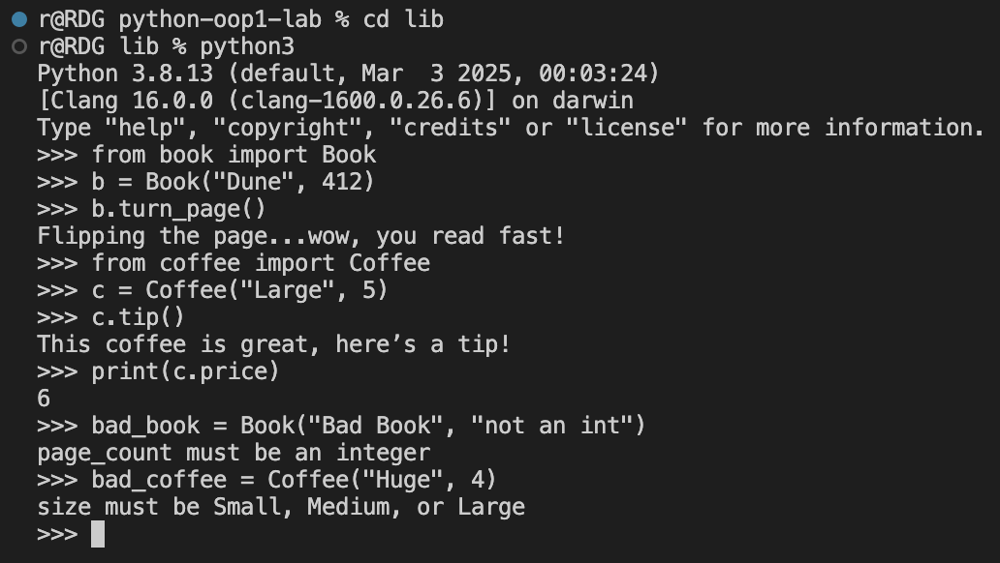

# Bookstore OOP Lab

A project that models a basic bookstore system using two Python classes: `Book` and `Coffee` - contains custom properties with validation, and instance methods to simulate realistic behavior for both objects.

---

## # Table of Contents

- [Demo](#demo)
- [Setup](#setup)
- [Testing](#testing)
- [Features](#features)
- [File Structure](#file-structure)
- [License](#license)

---

## # Demo

---

## # Setup

1. Fork and clone the repo  
2. Create a virtual environment: `python3 -m venv .venv`
3. Activate virtual environment: 
  - Mac/Linux: `source .venv/bin/activate`  
  - Windows ` .venv\Scripts\activate`
4. Run code: 
  `python3 books.py`
  `python3 coffee.py`

---

## Testing
  - Install pytest: `pip install pytest`
  - Run the test files:  `pytest`
 
---

## Features

	•	Book class with title and page_count attributes
	•	Validates that page_count is an integer
	•	turn_page() method prints a message
	•	Coffee class with size and price attributes
	•	Validates that size is one of: Small, Medium, or Large
	•	tip() method increases price by 1 and prints a message